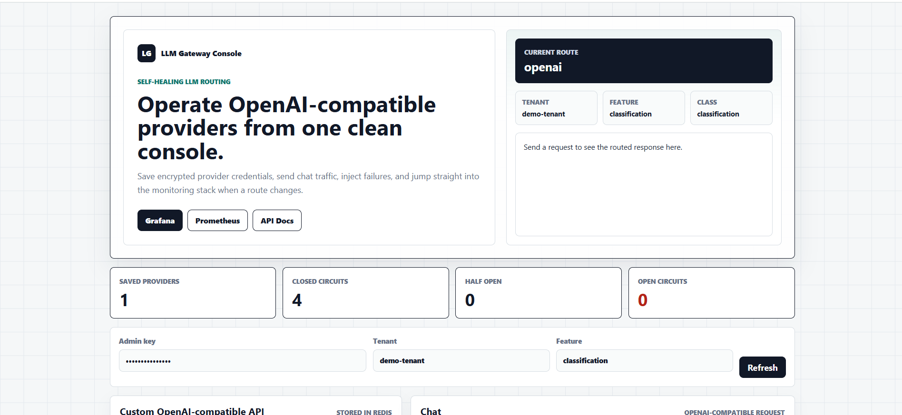
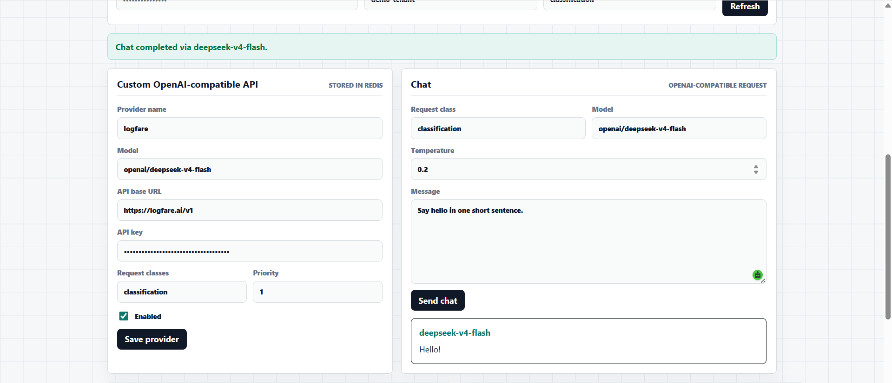
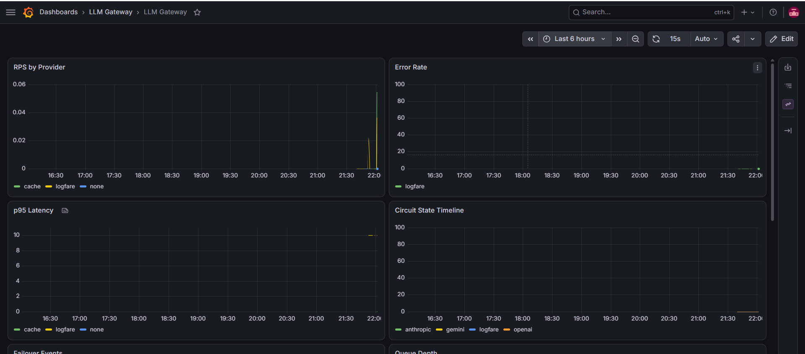
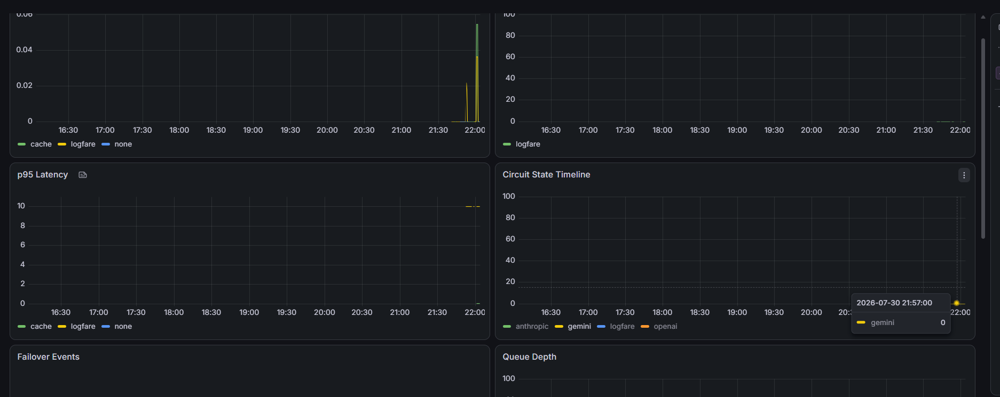
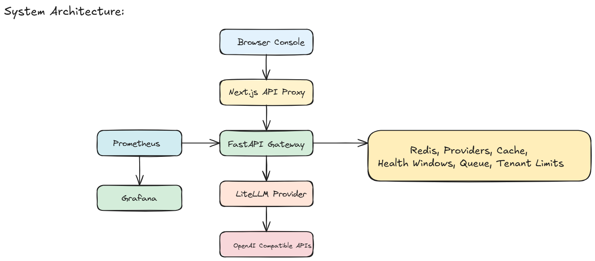

<h1 align="center">LLM Gateway</h1>

<p align="center">
  A production grade gateway for OpenAI compatible chat APIs with provider routing, circuit breaking, Redis persistence, semantic caching, tenant controls, chaos testing, and full observability.
</p>

<p align="center">
  FastAPI | LiteLLM | Redis | Prometheus | Grafana | Next.js | Pytest
</p>

<p align="center">
  
</p>

## Screenshots

<table>
  <tr>
    <td width="50%">
      
      <p align="center"><strong>Frontend console</strong></p>
    </td>
    <td width="50%">
      
      <p align="center"><strong>Successful chat</strong></p>
    </td>
  </tr>
  <tr>
    <td width="50%">
      
      <p align="center"><strong>Grafana dashboard</strong></p>
    </td>
    <td width="50%">
      
      <p align="center"><strong>Chaos demo</strong></p>
    </td>
  </tr>
</table>

## Overview

LLM Gateway is a reliability focused proxy for chat completion traffic. It exposes an OpenAI compatible API while routing requests across multiple configured providers. The gateway stores custom provider credentials in Redis with encrypted API keys, tracks provider health in sliding windows, opens circuits when a provider degrades, and reroutes traffic to healthier providers.

The project also includes a Next.js console for saving providers, sending chat requests, injecting chaos, and opening the monitoring tools.

## Core Capabilities

<table>
  <tr>
    <td><strong>OpenAI compatible API</strong></td>
    <td>Clients can point chat completion traffic at the gateway with a base URL change.</td>
  </tr>
  <tr>
    <td><strong>Provider routing</strong></td>
    <td>LiteLLM normalizes calls across configured OpenAI compatible providers.</td>
  </tr>
  <tr>
    <td><strong>Encrypted provider storage</strong></td>
    <td>Custom providers are persisted in Redis and API keys are encrypted with Fernet.</td>
  </tr>
  <tr>
    <td><strong>Health tracking</strong></td>
    <td>Redis sliding windows track success rate, p50 latency, p95 latency, p99 latency, and error type.</td>
  </tr>
  <tr>
    <td><strong>Circuit breaking</strong></td>
    <td>Providers move through closed, open, and half open states based on health thresholds.</td>
  </tr>
  <tr>
    <td><strong>Retry queue</strong></td>
    <td>Deferrable requests can move into a Redis queue with backoff, jitter, and idempotency.</td>
  </tr>
  <tr>
    <td><strong>Semantic cache</strong></td>
    <td>Repeated prompts can be served from Redis using normalized prompt hashes.</td>
  </tr>
  <tr>
    <td><strong>Tenant controls</strong></td>
    <td>Per tenant rate limits, monthly budgets, request logging, and PII redaction are included.</td>
  </tr>
  <tr>
    <td><strong>Observability</strong></td>
    <td>Prometheus metrics and a provisioned Grafana dashboard show traffic, errors, latency, circuit state, queue depth, and cost.</td>
  </tr>
</table>

## Architecture

<p align="center">
  
</p>

```text
Browser console
  |
  v
Next.js API proxy
  |
  v
FastAPI gateway
  |
  v
LiteLLM provider calls
  |
  v
OpenAI compatible inference APIs

FastAPI gateway
  |
  v
Redis for providers, cache, health windows, queue, and tenant limits

Prometheus scrapes gateway metrics
Grafana reads Prometheus dashboards
```

## Project Layout

<table>
  <tr>
    <td><code>frontend</code></td>
    <td>Next.js console for provider setup, chat testing, chaos actions, and monitoring links.</td>
  </tr>
  <tr>
    <td><code>backend/app/main.py</code></td>
    <td>FastAPI app with chat, provider admin, health, readiness, docs, and metrics routes.</td>
  </tr>
  <tr>
    <td><code>backend/app/providers.py</code></td>
    <td>Provider selection, LiteLLM calls, failover, hedging, queue handoff, and metrics.</td>
  </tr>
  <tr>
    <td><code>backend/app/runtime_config.py</code></td>
    <td>Redis provider store with encrypted API keys.</td>
  </tr>
  <tr>
    <td><code>backend/app/health.py</code></td>
    <td>Redis sliding window provider health tracker.</td>
  </tr>
  <tr>
    <td><code>backend/app/circuit_breaker.py</code></td>
    <td>Provider circuit breaker state machine.</td>
  </tr>
  <tr>
    <td><code>backend/app/queue.py</code></td>
    <td>Redis retry queue with idempotency protection.</td>
  </tr>
  <tr>
    <td><code>backend/app/chaos.py</code></td>
    <td>Admin chaos injection for synthetic provider latency and errors.</td>
  </tr>
  <tr>
    <td><code>monitoring</code></td>
    <td>Prometheus and Grafana provisioning.</td>
  </tr>
</table>

## Run Locally

From the project root, build the containers:

```powershell
docker compose build
```

Start the stack:

```powershell
docker compose up
```

Open these services:

<table>
  <tr>
    <td><strong>Frontend console</strong></td>
    <td><code>http://localhost:3001</code></td>
  </tr>
  <tr>
    <td><strong>Backend API</strong></td>
    <td><code>http://localhost:8000</code></td>
  </tr>
  <tr>
    <td><strong>API docs</strong></td>
    <td><code>http://localhost:8000/docs</code></td>
  </tr>
  <tr>
    <td><strong>Grafana</strong></td>
    <td><code>http://localhost:3000</code></td>
  </tr>
  <tr>
    <td><strong>Prometheus</strong></td>
    <td><code>http://localhost:9090</code></td>
  </tr>
</table>

To stop the stack:

```powershell
docker compose down
```

## Configuration

Create your local environment file:

```powershell
copy .env.example .env
```

Set the values that apply to your machine:

```dotenv
LLM_GATEWAY_ADMIN_API_KEY=your_admin_key
LLM_GATEWAY_METRICS_API_KEY=your_metrics_key
ENCRYPTION_KEY=your_fernet_key
LLM_GATEWAY_REDIS_URL=redis://redis:6379/0
LLM_GATEWAY_ENABLE_DOCS=true
```

Never commit real API keys. The local `.env` file is ignored by Git.

## Frontend Usage

Open the console:

```text
http://localhost:3001
```

Enter the admin key from your environment. Then use the provider form to save a custom OpenAI compatible API.

Example provider values:

```text
Provider name: logfare
Model: openai/deepseek_v4_flash
API base URL: https://logfare.ai/v1
API key: your_api_key
Request classes: classification
Priority: 1
Enabled: checked
```

After saving the provider, send a chat request from the chat panel. The browser talks to the gateway, and the gateway calls the provider.

## Custom Inference APIs

Any API that follows the OpenAI chat completion shape can be used.

For a hosted provider:

```text
API base URL: https://your_provider.example.com/v1
Model: openai/your_model
API key: your_api_key
```

For a local model server running on your computer while the backend runs in a container:

```text
API base URL: http://host.docker.internal:11434/v1
Model: openai/your_model
API key: local
```

Use `host.docker.internal` because `localhost` inside the backend container points to the container itself.

## Monitoring

Prometheus scrapes the gateway metrics endpoint. Grafana is provisioned with a dashboard for:

<table>
  <tr>
    <td>RPS by provider</td>
    <td>Error rate</td>
  </tr>
  <tr>
    <td>p95 latency</td>
    <td>Circuit state timeline</td>
  </tr>
  <tr>
    <td>Failover events</td>
    <td>Queue depth</td>
  </tr>
  <tr>
    <td>Cost per hour by tenant and feature</td>
    <td>Provider health at a glance</td>
  </tr>
</table>

## Chaos Demo

Use the frontend console to trigger provider chaos:

1. Start the stack.
2. Open the frontend console.
3. Save or select a provider.
4. Send a healthy chat request.
5. Open Grafana.
6. Click the Chaos action for the provider.
7. Send more chat requests.
8. Watch errors rise, the circuit open, and traffic reroute.
9. Wait for recovery and confirm the provider closes again.

## Health Checks

The backend exposes:

```text
http://localhost:8000/health
http://localhost:8000/ready
```

The health route confirms the process is alive. The ready route confirms Redis is reachable and at least one provider route can be used.

## Tests

Activate the virtual environment:

```powershell
.\venv\Scripts\Activate.ps1
```

Run the test suite:

```powershell
pytest backend\tests
```

The tests cover health tracking, circuit breaker cycles, deferrable queue behavior, semantic cache, tenant limits, PII redaction, runtime provider encryption, and production hardening.

Pytest cache is stored in:

```text
.tmp/pytest_cache
```

## Troubleshooting

### The frontend shows 503

This usually means no provider is available. Confirm that a provider is saved, enabled, mapped to the request class, and not blocked by an open circuit.

### Saved providers disappear

Do not delete Docker volumes if you want Redis data to stay. Use normal container restart commands for everyday development.

### Local provider does not respond

When the backend runs in a container, use `host.docker.internal` instead of `localhost` for services running on your computer.

### Admin actions return 403

Use the admin key configured in `LLM_GATEWAY_ADMIN_API_KEY`.

## Security Notes

This project is suitable as a portfolio grade implementation and local demo. Before production use, add managed secret storage, deployment specific identity controls, persistent Redis backups, stricter network policy, CI checks, and a full operational runbook.

## License

MIT License. See `LICENSE`.
